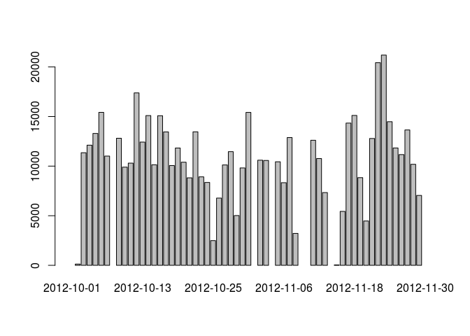
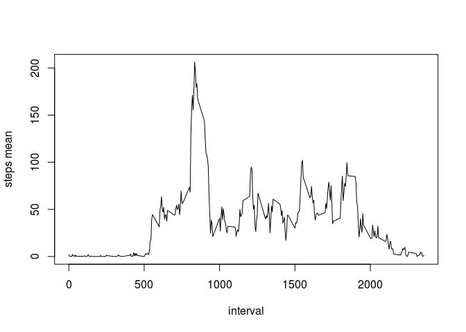
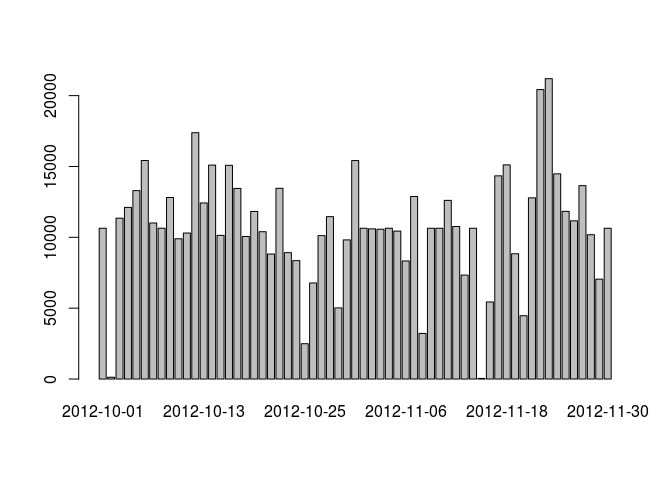
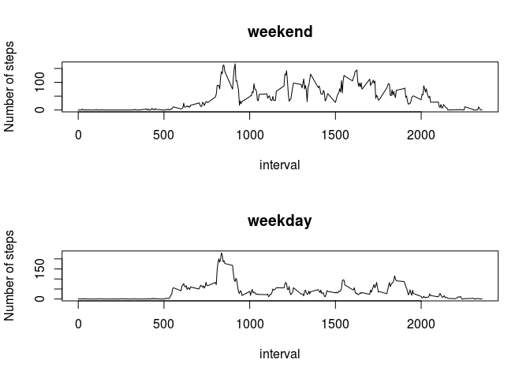

# Reproducible Research: Peer Assessment 1

## Loading and preprocessing the data

Load the data (i.e. read.csv())

```r
unzip("activity.zip")
activity <- read.csv("activity.csv")
```
Process/transform the data (if necessary) into a format suitable for your analysis

```r
# coerce date field to date type
activity$date <- as.Date(activity$date, format="%Y-%m-%d")
```

## What is mean total number of steps taken per day?

Calculate the total number of steps taken per day

```r
library(dplyr)
sum_steps_per_day <- activity %>% group_by(date) %>% summarise(steps = sum(steps))
```

Make a histogram of the total number of steps taken each day

```r
barplot(sum_steps_per_day$steps, names.arg = sum_steps_per_day$date)
```



Calculate and report the mean and median of the total number of steps taken per day

```r
mean_steps <- mean(sum_steps_per_day$steps, na.rm = TRUE)
mean_steps
```

```
## [1] 10766.19
```

```r
median_steps <- median(sum_steps_per_day$steps, na.rm = TRUE)
median_steps
```

```
## [1] 10765
```

## What is the average daily activity pattern?

Make a time series plot (i.e. type = "l") of the 5-minute interval (x-axis) and the average number of steps taken, averaged across all days (y-axis)

```r
mean_steps_per_interval <- activity %>% group_by(interval) %>% summarise(steps = mean(steps, na.rm = TRUE))
plot(mean_steps_per_interval$interval, mean_steps_per_interval$steps, type="l", xlab="interval", ylab="steps mean")
```



Which 5-minute interval, on average across all the days in the dataset, contains the maximum number of steps?

```r
mean_steps_per_interval$interval[which.max(mean_steps_per_interval$steps)]
```

```
## [1] 835
```

## Imputing missing values

Calculate and report the total number of missing values in the dataset (i.e. the total number of rows with NAs)

```r
total_missing_values <- sum(is.na(activity$steps))
```

Devise a strategy for filling in all of the missing values in the dataset. The strategy does not need to be sophisticated. For example, you could use the mean/median for that day, or the mean for that 5-minute interval, etc.
Create a new dataset that is equal to the original dataset but with the missing data filled in.

```r
activity_imputed <- activity
activity_imputed <- merge(activity_imputed, mean_steps_per_interval, by = "interval")
for( i in 1:length(activity_imputed$steps.x) ) {
    if( is.na(activity_imputed$steps.x[i]) ) {
        activity_imputed$steps.x[i] <- activity_imputed$steps.y[i]
    }
}
activity_imputed <- activity_imputed %>% rename(steps = steps.x)
# coerce steps back into integer values
activity_imputed$steps <- as.integer(activity_imputed$steps)
```

Make a histogram of the total number of steps taken each day and Calculate and report the mean and median total number of steps taken per day.

```r
sum_steps_per_day_imputed <- activity_imputed %>% group_by(date) %>% summarise(steps = sum(steps))
barplot(sum_steps_per_day_imputed$steps, names.arg = sum_steps_per_day_imputed$date)
```



```r
mean_steps_imputed <- mean(sum_steps_per_day_imputed$steps, na.rm = TRUE)
median_steps_imputed <- median(sum_steps_per_day_imputed$steps, na.rm = TRUE)
```
Do these values differ from the estimates from the first part of the assignment?
The mean and median values get smaller withe the imputed vlues

```r
mean_steps_imputed - mean_steps
```

```
## [1] -16.41819
```

```r
median_steps_imputed - median_steps
```

```
## [1] -124
```

What is the impact of imputing missing data on the estimates of the total daily number of steps?
There overall number steps is bigger when using imputed values since NA values add nothing to the suma

```r
sum(sum_steps_per_day_imputed$steps, na.rm = TRUE) - sum(sum_steps_per_day$steps, na.rm = TRUE)
```

```
## [1] 85128
```


## Are there differences in activity patterns between weekdays and weekends?
Create a new factor variable in the dataset with two levels – “weekday” and “weekend” indicating whether a given date is a weekday or weekend day.

```r
weekday <- function(x) {
    wday <- as.POSIXlt(x)$wday
    if( wday == 6 || wday == 0 ) {
        "weekend"
    } else {
        "weekday"
    }
}

activity_imputed$day <- sapply(activity_imputed$date, weekday)
```

Make a panel plot containing a time series plot (i.e. type = "l") of the 5-minute interval (x-axis) and the average number of steps taken, averaged across all weekday days or weekend days (y-axis). See the README file in the GitHub repository to see an example of what this plot should look like using simulated data.

```r
mean_day <- activity_imputed %>% group_by(interval, day) %>% summarise(steps = mean(steps))
par(mfrow=c(2,1))
plot(mean_day$interval[mean_day$day=="weekend"], mean_day$steps[mean_day$day=="weekend"], type="l", main="weekend", xlab="interval", ylab = "Number of steps")
plot(mean_day$interval[mean_day$day=="weekday"], mean_day$steps[mean_day$day=="weekday"], type="l", main="weekday", xlab="interval", ylab = "Number of steps")
```


